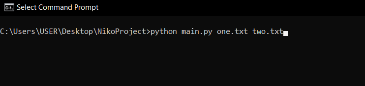
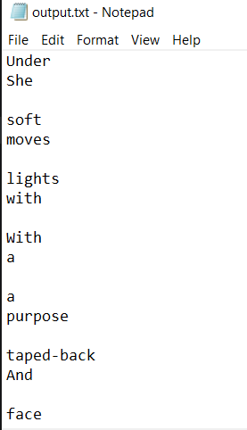

# Code for Niko

### How to use!

Open a cmd window

Navigate to the folder that you have `main.py` saved in,
making sure the plain-text book files are also saved in
the same folder.

Then run the following command, replacing everything after `main.py`
with the file names of your plain-text books.

Your formatted book list will be in the output folder and
be called `output.txt`

With the input files `one.txt` and `two.txt` (two bm song lyrics)
the output looks like this

Also note the output file will change every time you run it with new input
so make a copy of any output files you like before you run the program again
